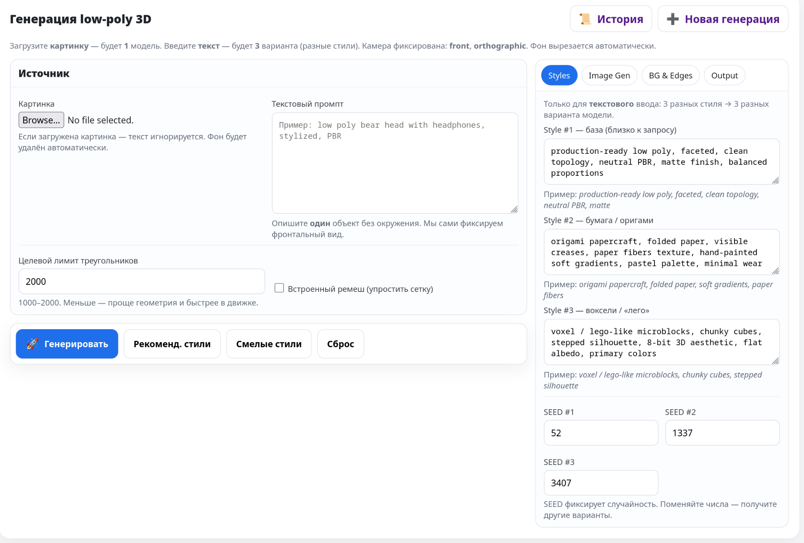
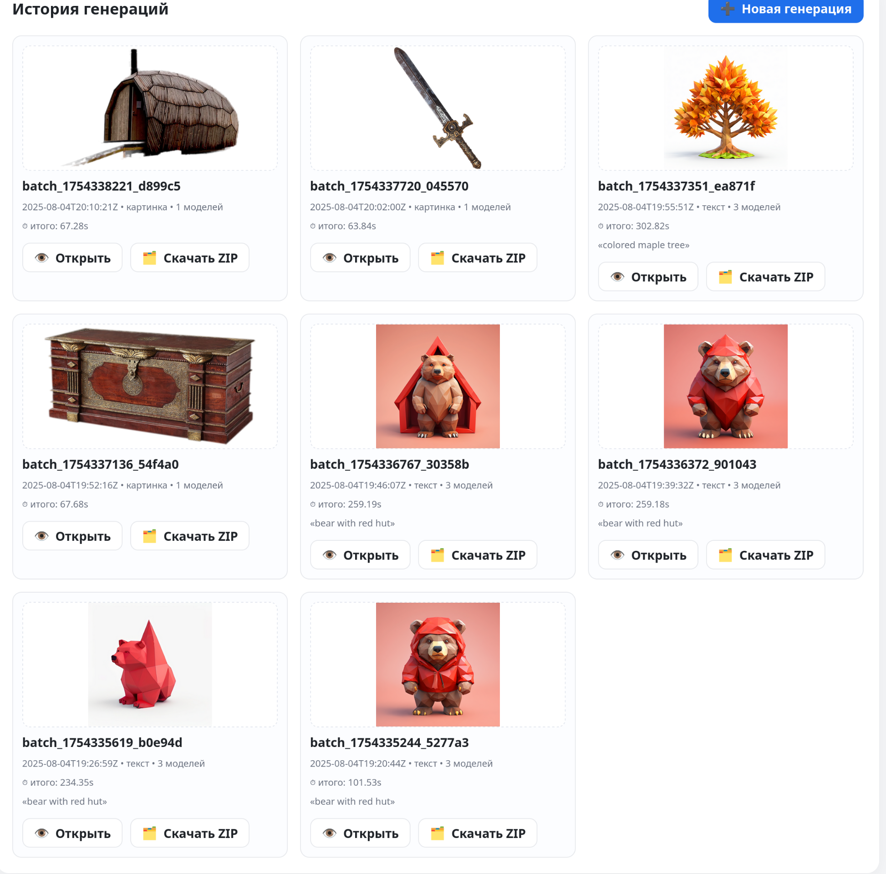
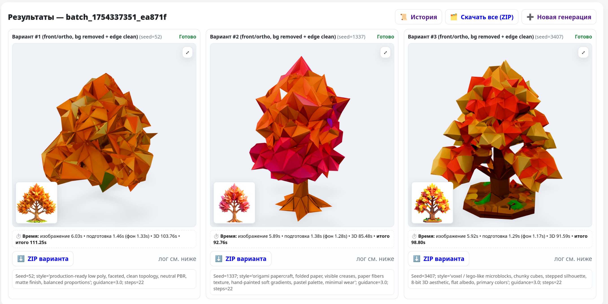
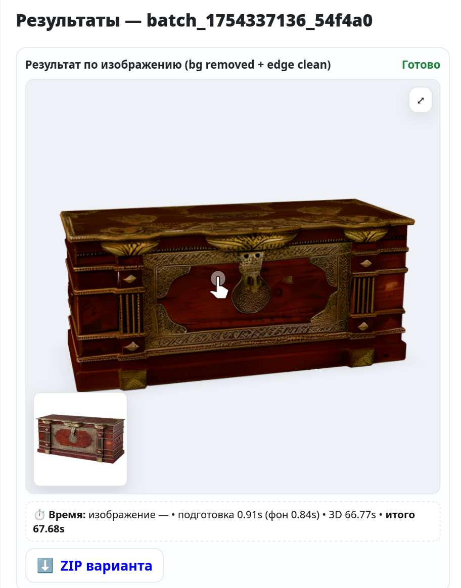

````markdown
# 🎮 Low‑Poly 3D Generator  
**Команда Квадрицепс · GameDevAI 2025**

---

## 1. Идея и цель

Создание стилизованных 3D-ассетов вручную — дорого и долго; мы решаем эту проблему, автоматически генерируя готовые low-poly модели с PBR-текстурами из текстового описания или картинки всего за 1 минуту.

---

## 2. Особенности и преимущества

| Возможность                      | Подробности реализации                                             | Польза для пользователя                                   |
|----------------------------------|--------------------------------------------------------------------|-----------------------------------------------------------|
| Два типа ввода                   | Поддержка текстовых промптов и загрузки изображений                | Позволяет использовать любые исходные данные              |
| End-to-End pipeline              | Полный цикл: изображение → mesh + UV → текстуры → `.glb` файл      | Экономит время, убирая промежуточные шаги и ручную работу |
| Стилизация                       | Три готовых пресета: `production-ready`, `origami`, `voxel`        | Быстрая смена визуального стиля без постобработки         |
| Управление памятью (VRAM)        | Attention slicing, выгрузка пайплайнов, не более 15 GB на RTX 4090 | Работает на доступной видеокарте RTX 4090                 |
| Интерактивный предпросмотр       | Встроенный `<model-viewer>` с камерой и AR прямо в браузере        | Быстрая демонстрация и проверка ассетов                   |
| Удобный экспорт                  | Автоматическое создание и скачивание GLB/OBJ в ZIP-архивах         | Лёгкая интеграция в любой пайплайн                        |

**Сравнение моделей:**  
Наше исследование (`demo/0_models_comparison.png`) показало превосходство **Playground v2.5** (качество изображения выше, чем у SDXL и Midjourney), а для генерации mesh и текстур выбран state-of-the-art подход — **Hunyuan3D 2.1**.

---

## 3. Архитектура / Реализация

```mermaid
flowchart TD
    subgraph docker[Docker Container]
        direction TB
        A[Flask + Granian<br>(REST / SSE)] --> B[Pipelines<br>• Playground v2.5<br>• Hunyuan3D 2.1]
        B --> C[Storage<br>(GLB / OBJ / ZIP)]
        A --> D[Frontend<br>(HTML + <model-viewer>)]
    end
    E[User Browser] -->|HTTP/WebSocket| A
    C -->|Static Files| D
````

**Технологический стек:**

* **Image Generation:** Playground v2.5 (1024² изображение)
* **3D Mesh + UV + PBR:** Hunyuan3D 2.1 (Flow Matching + Paint Pipeline)
* **Frameworks:** Python 3.10, PyTorch 2.5.1 (CUDA 12.4)
* **Web Backend:** Flask + Granian WSGI, WhiteNoise (статика)
* **Frontend:** HTML/CSS + JavaScript + Google `<model-viewer>` (AR)
* **Конвертация:** Blender bpy 4.0 для OBJ↔GLB
* **Deployment:** Docker-контейнер (Ubuntu 22.04)

**Производительность (RTX 4090 24 GB):**

| Этап                    | Среднее время  | Пик VRAM    |
| ----------------------- | -------------- | ----------- |
| Изображение 1024×1024   | 6–10 сек       | \~10 GB     |
| Реконструкция меша + UV | 20–35 сек      | \~13 GB     |
| Генерация текстур (PBR) | 30–50 сек      | \~15 GB     |
| **Полный цикл**         | **60–100 сек** | **\~15 GB** |

---

## 4. Пользовательский сценарий

### Пошаговый процесс:

1. Пользователь вводит текстовый промпт или загружает картинку.
2. Настраивает параметры: стиль, число полигонов, качество (CFG, steps).
3. Запускает генерацию, которая проходит автоматически через все этапы:

   * Playground v2.5 → референс-изображение
   * Hunyuan3D 2.1 → mesh + UV
   * Paint Pipeline → текстуры PBR
4. Пользователь видит готовую модель в браузере через `<model-viewer>` (интерактивное вращение, AR-режим).
5. Скачивает готовый `.glb` или архив `.zip`.

### Видео-демонстрации

| Генерация из текста                                                                             | Генерация из изображения                                                                         |
| ----------------------------------------------------------------------------------------------- | ------------------------------------------------------------------------------------------------ |
| [🎥 Text → 3D](https://github.com/user-attachments/assets/f8d28916-285b-4227-8e11-44284aa82dd8) | [🎥 Image → 3D](https://github.com/user-attachments/assets/74f5cb44-2fab-447a-ad33-ba22a0de1eb9) |

> ⚠️ Рекомендуемый формат для вставки видео на GitHub — `.mp4`, используйте HTML-теги `<video>`.

### Скриншоты интерфейса

| Главная страница            | История генераций            |
| --------------------------- | ---------------------------- |
|  |  |

| Примеры ассетов из текста            | Ассеты из изображений                 |
| ------------------------------------ | ------------------------------------- |
|  |  |

| Сравнение моделей                        |
| ---------------------------------------- |
|  |

---